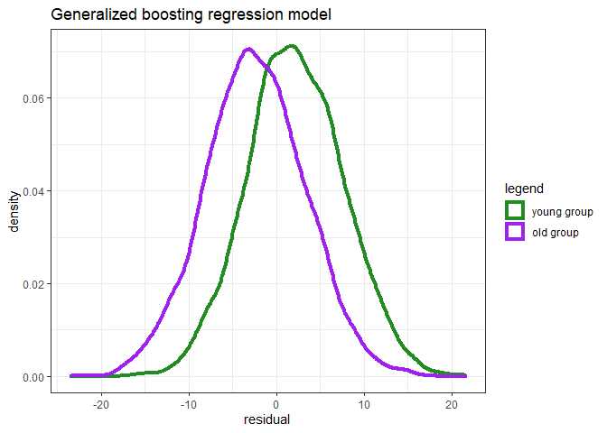

Marije Sluiskes

# Regression to the sample’s mean age in biological age prediction

## What is regression to the mean?

Regression to the mean is a statistical phenomenon that occurs whenever
two variables of interest are imperfectly correlated. Let’s call these
variables

and
.
On average, when a measurement of

deviates from the mean of this variable, the corresponding measurement
of

will be closer to its mean. This occurs whenever the correlation
coefficient between

and

is smaller than one.

It is easiest to understand this phenomenon by considering two extreme
cases. Assume that

and

are normally distributed with mean

and standard deviation
.
(This is just for simplicity of the subsequent formulas, but if not met,
they can be adjusted without loss of generality.) Denote the correlation
coefficient between

and

by
.

Now, for a given subject
,
draw measurement

from
.
The expected value for measurement

is then
").
If there is a perfect correlation between

and

(i.e. ),
![E\[y\_i\] = x\_i](https://latex.codecogs.com/png.image?%5Cdpi%7B110%7D&space;%5Cbg_white&space;E%5By_i%5D%20%3D%20x_i "E[y_i] = x_i").
If they are completely independent,
![E\[y\_i\] = \\mu](https://latex.codecogs.com/png.image?%5Cdpi%7B110%7D&space;%5Cbg_white&space;E%5By_i%5D%20%3D%20%5Cmu "E[y_i] = \mu").

In reality, for any

and
,

will often be somewhere in between these two extreme cases. Hence, if
you select subjects with extreme measurements of
,
the average of the measurements for

for these subjects will be closer to the mean.

## Why is it relevant in the context of biological age prediction?

A commonly used approach to predict biological age is to perform
multiple linear regression on cross-sectional data: chronological age

is taken as the outcome variable and regressed on a set of markers

that were measured at the same point in time as chronological age (i.e.,
a cross-sectional set-up). Then the model’s predicted chronological age
is considered to be informative of one’s biological aging
:
,
where

denotes the number of included markers. In other words, the residuals
(the differences between

and
)
are interpreted as meaningful quantities in their own right.

The correlation between chronological age and the markers will not be
perfect. There is a (significant) source of random error. Hence, there
will be regression to the mean: predicted values for

will tend to regress toward the sample’s mean chronological age.
*Individuals younger than this sample mean age will obtain predicted
ages that are on average too high, and individuals older than this mean
age will receive predicted ages that are too low.* This phenomenon has
been recognized to be an issue in the context of cross-sectional
biological age prediction for decades: see e.g. [Dubina et
al. (1984)](https://www.sciencedirect.com/science/article/pii/0531556584900160)
or [Hochschild
(1989)](https://www.sciencedirect.com/science/article/pii/0531556589900028).

Though this phenomenon has primarily been discussed in the context of
(multiple) linear regression, it also holds for other types of
regression models using cross-sectional data to predict
chronological/biological age. In the example below, both a linear
regression model and a boosted regression model are used to illustrate
this.

## Illustration with simulated data

``` r
library(gbm)
library(ggplot2)
```

Consider a training data set of size
.
Assume the model
.
In the context of cross-sectional biological age prediction,

can be considered some marker of chronological age and

(some scaled version of) chronological age.

Fit two models on the training data: a simple linear regression model
(LR) and a generalized boosted regression model (GBM).

``` r
set.seed(18)

n = 10000
X <- rnorm(n,0,6)
eps <- rnorm(n,0,6)
beta = 2

Y <- beta*X + eps

# fit models
lr_fit <- lm(Y ~ X)
gbm_fit = gbm(Y ~ X, distribution = "gaussian", n.trees = 100)

summary(lr_fit)
```

    ## 
    ## Call:
    ## lm(formula = Y ~ X)
    ## 
    ## Residuals:
    ##      Min       1Q   Median       3Q      Max 
    ## -23.1606  -4.0610   0.0163   4.0387  21.0570 
    ## 
    ## Coefficients:
    ##             Estimate Std. Error t value Pr(>|t|)    
    ## (Intercept) -0.04766    0.06006  -0.793    0.428    
    ## X            1.97351    0.01006 196.219   <2e-16 ***
    ## ---
    ## Signif. codes:  0 '***' 0.001 '**' 0.01 '*' 0.05 '.' 0.1 ' ' 1
    ## 
    ## Residual standard error: 6.006 on 9998 degrees of freedom
    ## Multiple R-squared:  0.7939, Adjusted R-squared:  0.7938 
    ## F-statistic: 3.85e+04 on 1 and 9998 DF,  p-value: < 2.2e-16

``` r
# get fitted values
lr_fitted <- fitted(lr_fit)
gbm_fitted<-predict.gbm(gbm_fit,as.data.frame(X))
```

Now plot the residuals
()
against
.
For both models there is a downward sloping pattern visible: people with
higher chronological ages (higher
)
on average have lower predicted chronological ages (lower
).
The lower the correlation between

and
,
the stronger this effect.

``` r
df_fitted <- data.frame(Y, lr_fitted, gbm_fitted)

ggplot(aes(x = Y, y = lr_fitted - Y), data = df_fitted) +
  geom_abline(intercept = 0, slope = 0, col = "blue") + 
  geom_point() + 
  labs(title = "Linear regression model", y = "Predicted Y - Y") +
  theme_bw()
```

<!-- -->

``` r
ggplot(aes(x = Y, y = gbm_fitted - Y), data = df_fitted) +
  geom_abline(intercept = 0, slope = 0, col = "blue") + 
  geom_point() + 
  labs(title = "Generalized boosting regression model", y = "Predicted Y - Y") +
  theme_bw()
```

<!-- -->

Consider now a test set, sampled from the same population. Split the
test set in two groups, based on their value for
.
This would be similar to comparing groups from the general population
defined by their chronological age (e.g., old / long-lived individuals
with young individuals from the same population).

Use the models fitted on the training data to obtain predictions for

for the two groups. Now compare the values of the residuals between
these two groups.

``` r
set.seed(22)

nval=10000
x.val<-rnorm(nval,0,6)
y.val<-sapply(1:nval,function(i)beta*x.val[i]+rnorm(1,0,6))

#Long-lived group
y.val1<-y.val[y.val>0]
x.val1<-x.val[y.val>0]

#General population group
y.val0<-y.val[y.val<0]
x.val0<-x.val[y.val<0]

# MLR 
y.pred.val1<-sapply(1:length(x.val1),function(i)coef(lr_fit)[1]+coef(lr_fit)[2]*x.val1[i])
y.pred.val0<-sapply(1:length(x.val0),function(i)coef(lr_fit)[1]+coef(lr_fit)[2]*x.val0[i])

mlr.res1<-y.pred.val1-y.val1
mlr.res0<-y.pred.val0-y.val0

# GBM
y.predmatrix.val1 <-predict.gbm(gbm_fit, data.frame(X = x.val1))
y.predmatrix.val0 <-predict.gbm(gbm_fit, data.frame(X = x.val0))

gbm.res1<-y.predmatrix.val1-y.val1
gbm.res0<-y.predmatrix.val0-y.val0
```

Now compare the values of the residuals between these two groups.
Ideally, they should be similarly distributed and centered around zero:
after all, the random noise distribution is the same for the two groups,
namely a normal distribution with mean 0. However, due to the regression
to the mean phenomenon, those with a value for

that is higher than the sample mean on average receive a value for

that is lower than
,
and those with a value for

that is lower than the sample mean on average receive a value for

that is higher than
.

When using a t-test to compare the difference in the mean of the
residuals between the two groups, a significant difference is detected.
This holds for both models.

``` r
dftest_res0 <- data.frame(mlr.res0, gbm.res0)
dftest_res1 <- data.frame(mlr.res1, gbm.res1)
```

``` r
t.test(mlr.res1,mlr.res0)
```

    ## 
    ##  Welch Two Sample t-test
    ## 
    ## data:  mlr.res1 and mlr.res0
    ## t = -40.654, df = 9953.6, p-value < 2.2e-16
    ## alternative hypothesis: true difference in means is not equal to 0
    ## 95 percent confidence interval:
    ##  -4.746503 -4.309839
    ## sample estimates:
    ## mean of x mean of y 
    ## -2.400986  2.127185

``` r
ggplot(aes(x = mlr.res0), data = dftest_res0) +
  geom_density(aes(col = "darkgreen")) +
  geom_density(aes(x = mlr.res1, col = "purple"), data = dftest_res1) + 
  labs(title = "Linear regression model", x = "residual") +
  theme_bw() +
  scale_colour_identity(guide = "legend", 
                        name = "legend",
                        labels = c("young group", "old group"))
```

<!-- -->

``` r
t.test(gbm.res1,gbm.res0)
```

    ## 
    ##  Welch Two Sample t-test
    ## 
    ## data:  gbm.res1 and gbm.res0
    ## t = -42.36, df = 9952.4, p-value < 2.2e-16
    ## alternative hypothesis: true difference in means is not equal to 0
    ## 95 percent confidence interval:
    ##  -4.924866 -4.489235
    ## sample estimates:
    ## mean of x mean of y 
    ## -2.525503  2.181548

``` r
ggplot(aes(x = gbm.res0), data = dftest_res0) +
  geom_density(aes(col = "darkgreen")) +
  geom_density(aes(x = mlr.res1, col = "purple"), data = dftest_res1) + 
  labs(title = "Generalized boosting regression model", x = "residual") +
  theme_bw() +
  scale_colour_identity(guide = "legend", 
                        name = "legend",
                        labels = c("young group", "old group"))
```

<!-- -->

This simple simulated scenario illustrates that it is not valid to
interpret differences between true and predicted chronological age as an
indication of biological aging when comparing groups defined by their
chronological age. All cross-sectional age clocks will have a tendency
to overestimate the age of younger individuals and underestimate the age
of older individuals. This cannot be interpreted as a sign of
accelerated or decelerated biological aging.
