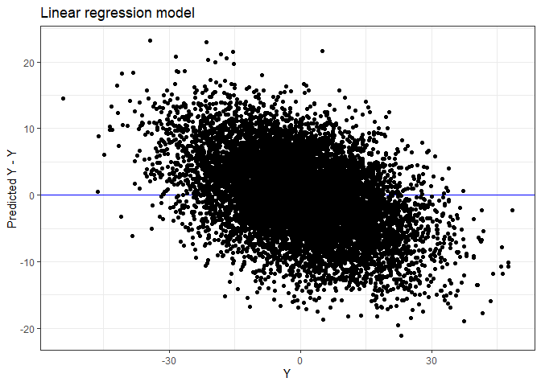
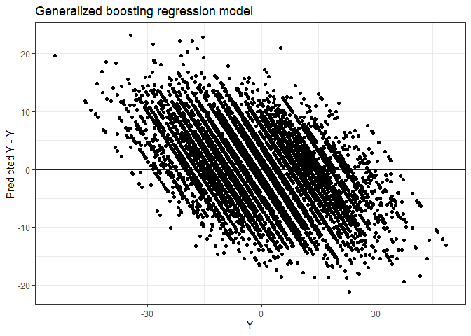

Marije Sluiskes

# Regression to the mean in biological age prediction

## What is regression to the mean?

## Why is it relevant in the context of biological age prediction?

## Example with simulated data

``` r
library(gbm)
library(ggplot2)
```

Consider a training data set of size
.
Assume the model
.
In the context of cross-sectional biological age prediction,

can be considered some marker of chronological age and

(some scaled version of) chronological age.

Fit two models on the training data: a simple linear regression model
(LR) and a generalized boosted regression model (GBM).

``` r
set.seed(18)

n=10000
X<-rnorm(n,0,6)
eps<-rnorm(n,0,6)
beta=2

Y<-beta*X+eps

# fit LR and GB model
lr_fit <- lm(Y~X)
gbm_fit = gbm(Y ~ X, distribution = "gaussian", n.trees = 100)

# fitted values
lr_fitted <- fitted(lr_fit)
gbm_fitted<-predict.gbm(gbm_fit,as.data.frame(X))
```

Now plot the residuals
()
against
.
For both models there is already a downward sloping pattern visible:
this is regression to the mean. People with higher chronological ages
(higher
)
on average have lower predicted chronological ages (lower
).
The lower the correlation between

and
,
the stronger this effect.

``` r
df_fitted <- data.frame(Y, lr_fitted, gbm_fitted)

ggplot(aes(x = Y, y = lr_fitted - Y), data = df_fitted) +
  geom_abline(intercept = 0, slope = 0, col = "blue") + 
  geom_point() + 
  labs(title = "Linear regression model", y = "Predicted Y - Y")
```

<!-- -->

``` r
ggplot(aes(x = Y, y = gbm_fitted - Y), data = df_fitted) +
  geom_abline(intercept = 0, slope = 0, col = "blue") + 
  geom_point() + 
  labs(title = "Generalized boosting regression model", y = "Predicted Y - Y")
```

<!-- -->

Consider now a test set, sampled from the same population. Split the
test set in two groups, based on their value for
.
This would be similar to comparing groups from the general population
defined by their chronological age (e.g., long-lived individuals with
middle-aged individuals).

Use the models fitted on the training data to obtain predictions for

for the two groups. Now compare the values of the residuals between
these two groups.

``` r
set.seed(22)

nval=10000
x.val<-rnorm(nval,0,6)
y.val<-sapply(1:nval,function(i)beta*x.val[i]+rnorm(1,0,6))

#Long-lived group
y.val1<-y.val[y.val>0]
x.val1<-x.val[y.val>0]

#General population group
y.val0<-y.val[y.val<0]
x.val0<-x.val[y.val<0]

# MLR 
y.pred.val1<-sapply(1:length(x.val1),function(i)coef(lr_fit)[1]+coef(lr_fit)[2]*x.val1[i])
y.pred.val0<-sapply(1:length(x.val0),function(i)coef(lr_fit)[1]+coef(lr_fit)[2]*x.val0[i])

mlr.res1<-y.val1-y.pred.val1
mlr.res0<-y.val0-y.pred.val0

# GBM
y.predmatrix.val1 <-predict.gbm(gbm_fit, data.frame(X = x.val1))
y.predmatrix.val0 <-predict.gbm(gbm_fit, data.frame(X = x.val0))

gbm.res1<-y.val1-y.predmatrix.val1
gbm.res0<-y.val0-y.predmatrix.val0
```

Now compare the values of the residuals between these two groups.
Ideally, they should be similarly distributed and centered around zero:
after all, the random noise distribution is the same for the two groups,
namely a normal distribution with mean 0. However, due to the regression
to the mean phenomenon, those with a value for

that is higher than the sample mean on average receive a value for

that is lower than
,
and those with a value for

that is lower than the sample mean on average receive a value for

that is higher than
.

When using a t-test to compare the difference in the mean of the
residuals between the two groups, a significant difference is detected.
This holds for both models.

``` r
dftest_res0 <- data.frame(mlr.res0, gbm.res0)
dftest_res1 <- data.frame(mlr.res1, gbm.res1)
```

``` r
t.test(mlr.res1,mlr.res0)
```

    ## 
    ##  Welch Two Sample t-test
    ## 
    ## data:  mlr.res1 and mlr.res0
    ## t = 40.654, df = 9953.6, p-value < 2.2e-16
    ## alternative hypothesis: true difference in means is not equal to 0
    ## 95 percent confidence interval:
    ##  4.309839 4.746503
    ## sample estimates:
    ## mean of x mean of y 
    ##  2.400986 -2.127185

``` r
ggplot(aes(x = mlr.res0), data = dftest_res0) +
  geom_density() +
  geom_density(aes(x = mlr.res1), data = dftest_res1, col = "blue") + 
  labs(title = "Linear regression model", x = "residual")
```

<!-- -->

``` r
t.test(gbm.res1,gbm.res0)
```

    ## 
    ##  Welch Two Sample t-test
    ## 
    ## data:  gbm.res1 and gbm.res0
    ## t = 42.36, df = 9952.4, p-value < 2.2e-16
    ## alternative hypothesis: true difference in means is not equal to 0
    ## 95 percent confidence interval:
    ##  4.489235 4.924866
    ## sample estimates:
    ## mean of x mean of y 
    ##  2.525503 -2.181548

``` r
ggplot(aes(x = gbm.res0), data = dftest_res0) +
  geom_density() +
  geom_density(aes(x = gbm.res1), data = dftest_res1, col = "blue") + 
  labs(title = "Generalized boosting regression model", x = "residual") 
```

<!-- -->

This simple simulated scenario illustrates that it is not valid to
interpret differences between true and predicted chronological age as an
indication of biological aging when comparing groups defined by their
chronological age. All cross-sectional age clocks will have a tendency
to overestimate the age of younger individuals and underestimate the age
of older individuals. This cannot be interpreted as a sign of
accelerated or decelerated biological aging.
